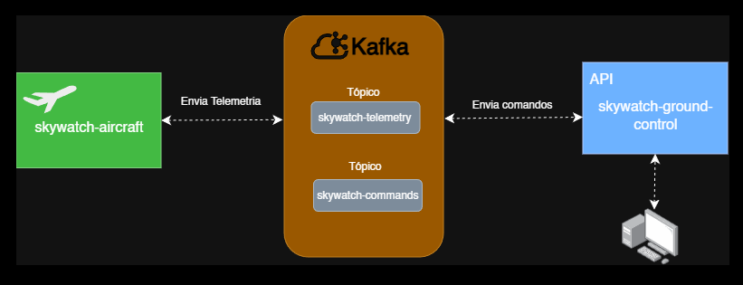

## ✈️ SkyWatch – Aircraft Simulator
📌 Visão Geral

O SkyWatch Aircraft Simulator é um microserviço Spring Boot que emula uma aeronave enviando telemetria em tempo real para uma central no solo através do Apache Kafka.

Cada instância do serviço representa uma aeronave independente, identificada por um aircraftId.

🎯 Responsabilidades

- Simular dados de voo:

  - Altitude

  - Velocidade

  - Nível de combustível

- Publicar telemetria periodicamente no Kafka

- Consumir comandos enviados pelo Ground Control

- Executar ações como início de descida/pouso

## 🧩 Arquitetura

📡 Comunicação Kafka
📤 Producer

- Topic: skywatch-telemetry

- Key: aircraftId

- Value: JSON (AircraftData)

📥 Consumer

- Topic: skywatch-commands

- Key: aircraftId

- Value: String (ex: LAND)

🧠 Simulação de Voo

- Telemetria enviada a cada 2 segundos

- Consumo gradual de combustível

- Altitude de cruzeiro simulada

- Ao receber comando de pouso:

  - Entra em modo de descida

  - Reduz altitude progressivamente

🛠️ Tecnologias

- Java 17

- Spring Boot

- Spring Kafka

- Apache Kafka
